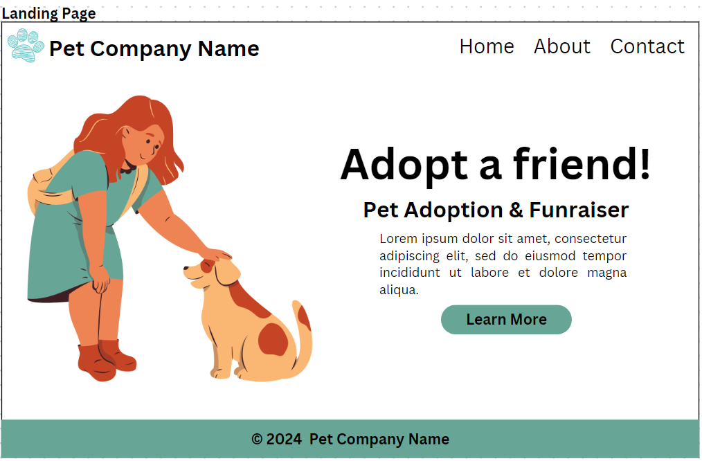

# CSS-Pet-Adoption

## Objectives

## Wireframe

This is my plan for the landing page of this website using only HTML and CSS. This wireframe was created on Canva.com.

## Resources and Information Used

I used these following sites to build content for this pet adoption project.  
https://acadianaanimalaid.org/  
https://www.humanesociety.org/resources/pet-owners

## Photo Credits

Most of the images used on this project was from Unsplash & Freepik.

### Landing Images

<a href="https://www.freepik.com/free-vector/flat-people-with-pets-pack_14448025.htm#query=pet%20and%20owner%20clipart&position=12&from_view=search&track=ais&uuid=5e4adcf5-2e22-44bb-9862-bf2c913dcde6">Image by pikisuperstar</a> on Freepik

### Unsplash Images

Gallery Pics :  
 https://unsplash.com/@alvannee  
 https://unsplash.com/@madhatterzone  
 https://unsplash.com/@karsten116  
New Arrival Pics :  
 https://unsplash.com/@kabofoods  
 https://unsplash.com/@kanashi  
 https://unsplash.com/@victor_vector

## Code Credits

I used code references and documentation from MDN, W3Schools, and css-tricks.com.  
<a href="https://developer.mozilla.org/en-US/docs/Web/CSS/CSS_grid_layout"> Grid Layout</a>  
<a href="https://css-tricks.com/snippets/css/a-guide-to-flexbox/">Flexbox</a>  
<a href="https://www.w3schools.com/css/css3_mediaqueries.asp">Media Queries</a>
